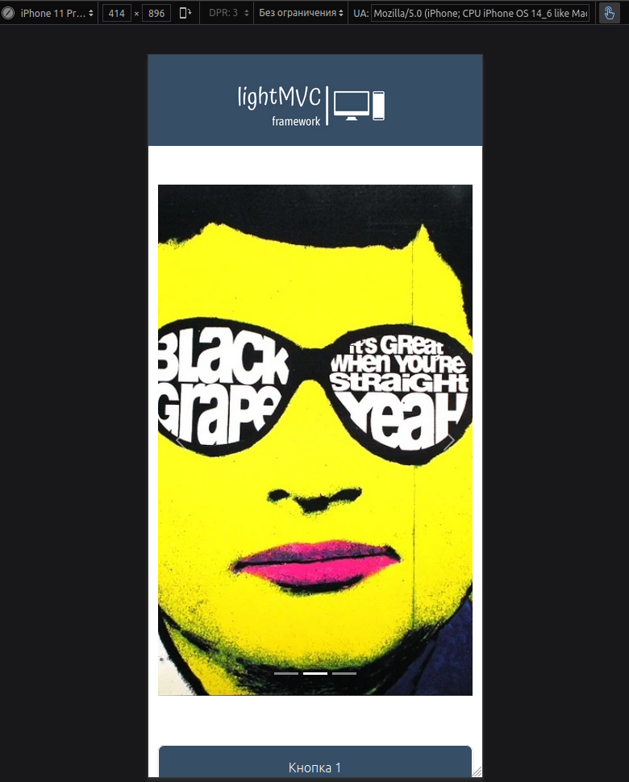
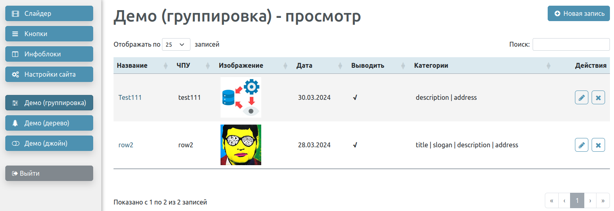
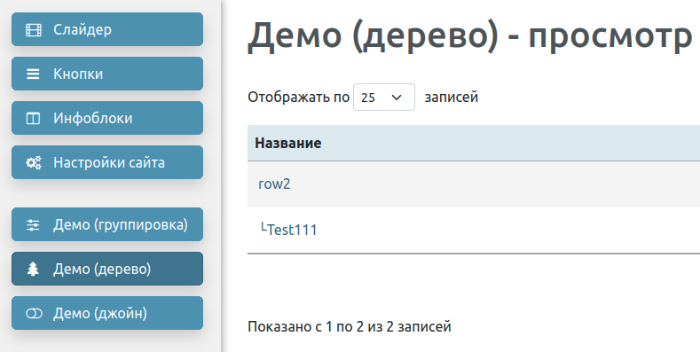
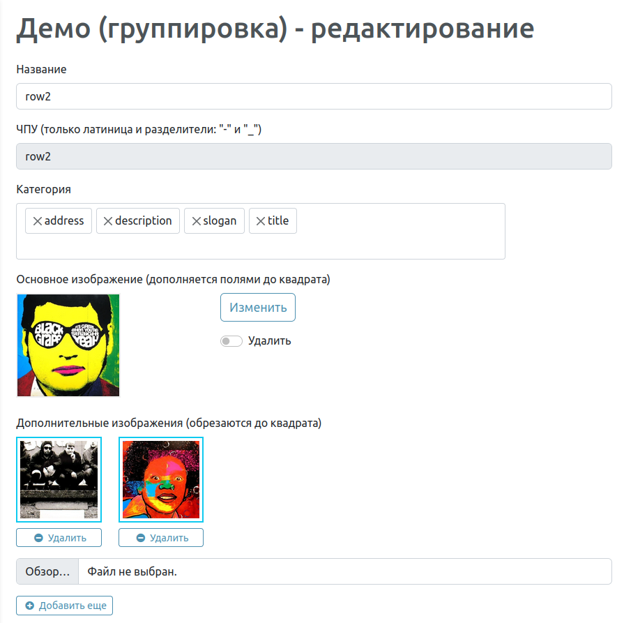
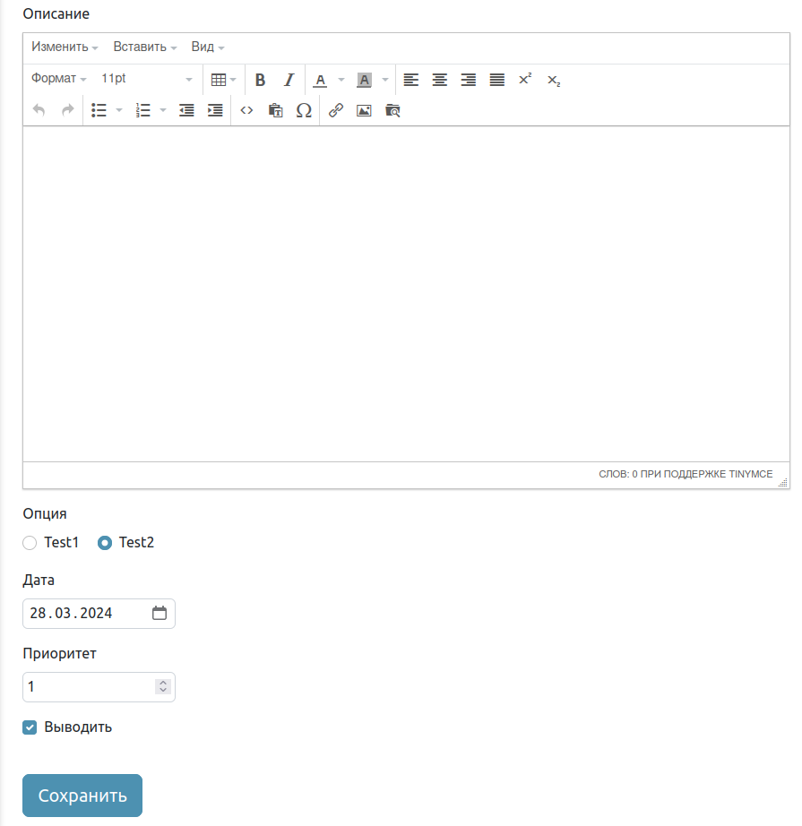

# Микрофреймворк для быстрого создания веб-сайтов lightMVC
Как следует из названия, фреймворк поддерживает архитектруру MVC, соответственно, имеет ядро из суперклассов: модель, представление и контроллер + рутер. Имеется легкая надстройка над PDO в виде подключаемой библиотеки, сокращающая трудоемкость составления запросов к БД.

## Развертывание
Необходимо переименовать шаблон db.default.php в db.php и заполнить значениями для подключения к БД. В файле db.sql приведен код для создания БД. Указанные файлы находятся в /application/config

## Фронтэнд
В данном репозитории фронт представлен одностраничником с адаптивной версткой. Хотя движок используется и для других проектов со сложной архитектурой, например, интернет-магазинов и корпоративных сайтов.  

## Панель управления
Позволяет производить редактирование и добавление записей в БД. Все настройки просмотра и редактирования таблиц задаются в виде единого массива с интуитивно понятной структурой, сохраняемого в файле конфигурации. Путь к файлу: application/config/admin.php Верстать веб-формы и программировать их обработку не требуется, всё создается автоматически на основе конфига.

### Админка поддерживает следующие возможности:
* Поиск, сортировка и пейджинг в режиме просмотра записей
* Вывод иерархических данных в виде дерева

* Форматирование текста в визуальном редакторе tinyMCE с подгрузкой изображений
* Множественный выбор опций в выпадающем списке (multiselect)
* Загрузка одиночных и множественных изображений
* Поле даты с календарем (datepicker)
* Радио-кнопки
* Поле, автоматически заполняемое транслитом на основе содержимого связанного поля
* Опция обязательного для заполнения поля
* Опция шаблонизации данных инпута
* Опция защиты от последующего редактирования инпута, можно ввести значение только при создании записи

